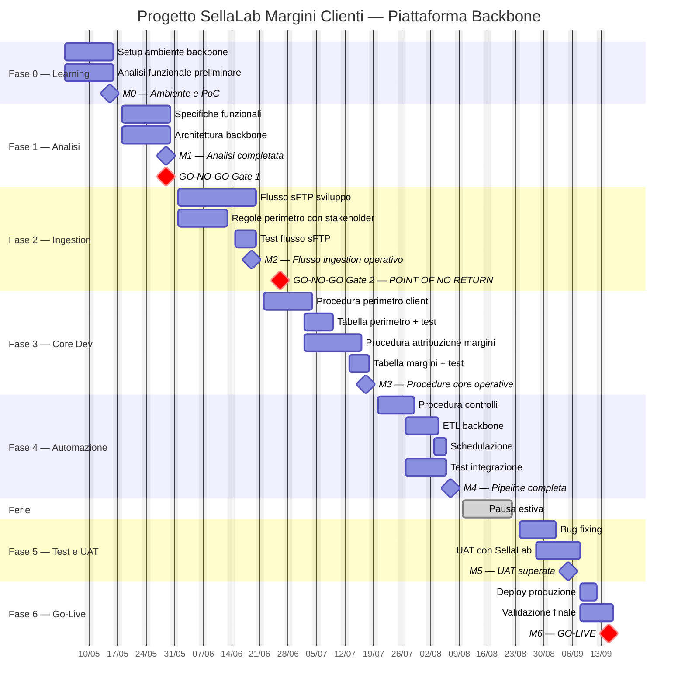

# Piano di Progetto — SellaLab Margini Clienti su Piattaforma Backbone

**Data redazione:** 13/05/2026  
**Progetto:** 0023650 — SellaLab Centrico FrameworkPM  
**Piattaforma target:** Backbone (originariamente Oracle)  
**Team:** 1 Programmatore Senior + 1 Analista  
**Periodo:** 01/05/2026 – 15/09/2026 (19,5 settimane — ~86 gg lavorativi)

---

## 1. Premessa e Fattori di Rischio

Il progetto è stimato in **36 gg/uomo su Oracle** e **30 gg/uomo su Backbone** (la piattaforma backbone è nativamente più efficiente). Tuttavia il team non ha esperienza né formazione sulla nuova piattaforma, il che richiede una contingency significativa.

| Fattore di rischio | Impatto | Mitigazione |
|--------------------|---------|-------------|
| **Nessuna esperienza** del team sulla piattaforma | Alto | Fase di learning dedicata + contingency 40% su attività di sviluppo |
| **Nessuna formazione** erogata | Alto | Autoformazione + eventuale supporto da team backbone |
| **Assenza di Informatica PowerCenter** su backbone | Medio-Alto | ETL nativo backbone (da esplorare) — contingency 60% su ETL |
| **Integrazione sFTP** da ridisegnare | Medio | Analisi architetturale dedicata |
| **Periodo estivo** (agosto) | Medio | Pianificazione ferie coordinate, milestone pre-ferie |

---

## 2. Ricalcolo Effort con Contingency Backbone

La stima backbone base (30 gg/uomo) riflette l'efficienza nativa della piattaforma. La contingency è applicata **sopra** la stima backbone per compensare l'inesperienza del team.

| Attività | Oracle (gg) | Backbone base (gg) | Contingency | Backbone finale (gg) | Note |
|----------|:-----------:|:------------------:|:-----------:|:--------------------:|------|
| **Learning/Setup piattaforma** | — | — | nuova voce | **8,00** | Non in stima originale — autoformazione |
| Flusso contatti sFTP → DBU | 7,00 | 5,75 | +40% | 8,05 | Nuova infrastruttura sFTP |
| Procedura perimetro clienti | 4,40 | 3,60 | +40% | 5,04 | Logica procedurale nuova piattaforma |
| Tabella perimetro clienti/stock | 3,85 | 3,15 | +40% | 4,41 | Data model backbone |
| Procedura attribuzione margini | 4,40 | 3,60 | +40% | 5,04 | Lettura tabelle esistenti margine interesse |
| Tabella margini | 3,85 | 3,15 | +40% | 4,41 | Data model backbone |
| Procedura controlli | 4,40 | 3,60 | +40% | 5,04 | Data quality su backbone |
| ETL | 3,30 | 2,70 | +60% | 4,32 | **Rischio alto**: no PowerCenter, ETL nativo |
| Schedulazione | 1,65 | 1,35 | +60% | 2,16 | Scheduler backbone da verificare |
| Analisi trasmissione dati | 2,00 | 1,65 | +50% | 2,48 | Architettura integrazione backbone ↔ CRM |
| **TOTALE** | **36,00** | **30,00** | | **50,95** | **+42% vs Oracle, +70% vs backbone base** |

> **Nota:** L'effort backbone base (30 gg) è inferiore a Oracle (36 gg) del ~17%. Tuttavia la contingency per inesperienza porta l'effort reale stimato a **~51 gg/uomo**, ovvero +42% rispetto a Oracle e +70% rispetto al backbone con team esperto.  
> Con l'acquisizione di esperienza nel tempo, i progetti successivi su backbone beneficeranno dell'effort base ridotto.

---

## 3. Calendario Lavorativo

| Mese | Giorni lavorativi | Note |
|------|:-----------------:|------|
| Maggio (dal 04/05) | 20 | 01/05 festivo (Festa del Lavoro) |
| Giugno | 20 | 02/06 festivo (Repubblica) |
| Luglio | 23 | — |
| Agosto | ~12 | Stimati 10 gg ferie (10–21 agosto) |
| Settembre (1–15) | 11 | — |
| **TOTALE** | **~86** | Per risorsa |

---

## 4. Gantt Dettagliato

### Legenda
- 🔵 Analista | 🟢 Programmatore Senior | 🟡 Entrambi
- ◆ Milestone | 🔴 Gate decisionale

```
                        MAGGIO                GIUGNO               LUGLIO              AGOSTO           SET
                   04  11  18  25  |  01  08  15  22  29  |  06  13  20  27  |  03  10  17  24  31  | 01  08  15
                   S1  S2  S3  S4    S5  S6  S7  S8  S9    S10 S11 S12 S13   S14 S15     FERIE      S18 S19 S20
────────────────────────────────────────────────────────────────────────────────────────────────────────────────────
FASE 0 - LEARNING  ████████████                                                                          
  🟢 Setup + PoC   ████████████                                                                          
  🔵 Analisi func. ████████████████                                                                      
                              ◆ M0 (15/05)                                                               
────────────────────────────────────────────────────────────────────────────────────────────────────────────
FASE 1 - ANALISI           ████████                                                                      
  🔵 Spec. funz.          ████████                                                                       
  🟢 Arch. backbone       ████████                                                                       
                                    ◆ M1 (29/05)                                                         
                                    🔴 GO/NO-GO #1                                                       
────────────────────────────────────────────────────────────────────────────────────────────────────────────
FASE 2 - INGESTION                  ████████████                                                         
  🟢 Flusso sFTP                    ████████████                                                         
  🔵 Regole perim.                  ████████                                                             
  🔵 Test cases                             ████                                                         
                                                ◆ M2 (19/06)                                             
                                                🔴 GO/NO-GO #2 — POINT OF NO RETURN                      
────────────────────────────────────────────────────────────────────────────────────────────────────────────
FASE 3 - CORE DEV                               ████████████████                                         
  🟢 Proc. perimetro                            ████████                                                 
  🟢 Proc. margini                                      ████████                                         
  🔵 Test perimetro                                 ████████                                             
  🔵 Test margini                                           ████████                                     
                                                                    ◆ M3 (17/07)                         
────────────────────────────────────────────────────────────────────────────────────────────────────────────
FASE 4 - AUTOMAZIONE                                                ████████████                         
  🟢 Controlli + ETL                                                ████████                             
  🟢 Schedulazione                                                          ████                         
  🔵 Test integrazione                                                  ████████                         
                                                                            ◆ M4 (07/08)                 
────────────────────────────────────────────────────────────────────────────────────────────────────────────
         FERIE ESTIVE                                                           ██████████               
────────────────────────────────────────────────────────────────────────────────────────────────────────────
FASE 5 - TEST & UAT                                                                     ████████████    
  🟡 Bug fixing                                                                          ████████       
  🟡 UAT con SellaLab                                                                        ████████   
                                                                                                 ◆ M5 (05/09)
────────────────────────────────────────────────────────────────────────────────────────────────────────────
FASE 6 - GO-LIVE                                                                                 ████████
  🟢 Deploy produzione                                                                           ████   
  🔵 Validazione finale                                                                          ████████
                                                                                                     ◆ M6 (15/09)
```

---

## 5. Milestone — Obiettivi, Sotto-attività e Criticità

---

### ◆ M0 — Ambiente e PoC (15/05/2026)

**Durata:** 04/05 – 15/05 (8 gg lavorativi)  
**Risorse:** 🟢 Programmatore Senior (full time) + 🔵 Analista (part time)

#### Obiettivo
Validare che la piattaforma backbone sia utilizzabile dal team: ambiente di sviluppo funzionante, primi artefatti creati, comprensione degli strumenti base.

#### Sotto-attività dettagliate

| # | Attività | Chi | Effort (gg) | Output atteso |
|---|----------|:---:|:-----------:|---------------|
| 0.1 | Richiesta e ottenimento accessi alla piattaforma (utenze dev, ambienti, repository) | 🟢 | 0,5 | Utenze attive |
| 0.2 | Installazione e configurazione IDE/tooling backbone | 🟢 | 1,0 | Ambiente locale operativo |
| 0.3 | Studio documentazione piattaforma (data model, linguaggio, API) | 🟢🔵 | 2,0 | Appunti e knowledge base interna |
| 0.4 | PoC #1: creazione tabella anagrafica di test su backbone | 🟢 | 1,0 | Tabella DDL creata e visibile |
| 0.5 | PoC #2: scrittura procedura base (INSERT/SELECT/UPDATE) | 🟢 | 1,5 | Procedura eseguita con successo |
| 0.6 | PoC #3: lettura dati da tabella esistente su datamart CoGe | 🟢 | 1,0 | Query cross-schema funzionante |
| 0.7 | Raccolta requisiti preliminare con team SellaLab (kick-off) | 🔵 | 1,0 | Minute del meeting + lista requisiti |

#### Deliverable
- Ambiente di sviluppo operativo con accessi configurati
- 3 PoC documentati (tabella, procedura, lettura cross-schema)
- Report di fattibilità tecnica preliminare

#### Criteri di accettazione
- [ ] Il programmatore è in grado di creare autonomamente tabelle su backbone
- [ ] Una procedura con logica condizionale (IF/ELSE) è stata eseguita
- [ ] È possibile leggere dati dalle tabelle del datamart CoGe esistente
- [ ] Il tempo per scrivere una procedura semplice è ≤ 3x rispetto a Oracle

#### Criticità e rischi specifici

| # | Rischio | Probabilità | Impatto | Mitigazione |
|---|---------|:-----------:|:-------:|-------------|
| R0.1 | Accessi e permessi non pronti entro il 04/05 | Alta | Bloccante | Richiedere accessi con 2 settimane di anticipo. Escalation al PM Centrico se non ottenuti entro 07/05 |
| R0.2 | Documentazione backbone insufficiente o assente | Media | Alto | Identificare un referente tecnico backbone interno. Richiedere affiancamento |
| R0.3 | Impossibilità di leggere tabelle CoGe da backbone (isolamento schema) | Media | Critico | Se confermato, è un **blocker architetturale** — potrebbe invalidare l'intero approccio backbone. Da verificare entro il 09/05 |
| R0.4 | PoC richiede più tempo del previsto | Media | Medio | Ridurre lo scope del PoC al minimo (solo tabella + procedura). Posticipare PoC cross-schema a M1 |

#### ⚠️ Segnali di allarme M0
- **07/05**: se gli accessi non sono ancora attivi → escalation immediata
- **12/05**: se nessun PoC è stato completato → valutare se è un problema di piattaforma o di setup
- **15/05**: se PoC #3 (cross-schema) fallisce → impatto su architettura intera

---

### ◆ M1 — Analisi Funzionale e Architettura (29/05/2026)

**Durata:** 18/05 – 29/05 (10 gg lavorativi)  
**Risorse:** 🔵 Analista (full time) + 🟢 Programmatore Senior (full time)

#### Obiettivo
Produrre l'analisi funzionale completa del sistema e il disegno architetturale specifico per backbone. Validare la fattibilità tecnica di tutti i componenti.

#### Sotto-attività dettagliate

| # | Attività | Chi | Effort (gg) | Output atteso |
|---|----------|:---:|:-----------:|---------------|
| 1.1 | Tavolo di lavoro con Barbara Salucci: regole perimetro clienti (privati e aziende) | 🔵 | 1,5 | Documento regole di perimetro validate |
| 1.2 | Tavolo di lavoro con Team SellaLab: regole attribuzione marginalità, voci CE, margine impieghi/raccolta | 🔵 | 1,5 | Mappatura voci margine → tabelle sorgente |
| 1.3 | Definizione data model backbone: schema tabelle perimetro, stock, margini | 🟢🔵 | 2,0 | DDL delle tabelle con documentazione campi |
| 1.4 | Progettazione architettura flusso sFTP su backbone (con CNT IT DQ — ref. Dario Bertodo) | 🟢 | 1,5 | Diagramma di flusso sFTP + requisiti infrastrutturali |
| 1.5 | Valutazione strumento ETL backbone (alternativa a Informatica PowerCenter) | 🟢 | 2,0 | Matrice di confronto ETL + raccomandazione |
| 1.6 | Definizione strategia di schedulazione e monitoraggio | 🟢 | 1,0 | Specifica scheduler + alerting |
| 1.7 | Redazione documento di analisi funzionale completo | 🔵 | 2,0 | Documento v1.0 |
| 1.8 | Review interna e approvazione con PM Centrico (Gaetano Stomboli) | 🔵🟢 | 0,5 | Documento approvato |

#### Deliverable
- Documento di analisi funzionale v1.0 approvato (include: perimetro, regole taggatura, margini, esclusioni)
- Disegno architetturale backbone (data model, flusso dati, integrazione DBU, ETL, scheduler)
- Matrice rischi tecnici aggiornata
- Requisiti infrastrutturali per CNT IT Data Quality

#### Criteri di accettazione
- [ ] Le regole di perimetro sono definite e approvate da Barbara Salucci
- [ ] Le voci di marginalità (impieghi, raccolta, ricavi) sono mappate sulle tabelle sorgente
- [ ] L'architettura sFTP è validata con il referente Dario Bertodo
- [ ] Esiste un piano concreto per l'ETL (strumento identificato, PoC pianificato)
- [ ] Il documento è stato approvato dal PM Centrico

#### Criticità e rischi specifici

| # | Rischio | Probabilità | Impatto | Mitigazione |
|---|---------|:-----------:|:-------:|-------------|
| R1.1 | Barbara Salucci o Team SellaLab non disponibili per tavoli di lavoro | Media | Alto | Pianificare i meeting entro il 12/05. Prevedere slot di backup nella settimana 25–29/05 |
| R1.2 | Requisiti infrastrutturali sFTP complessi (ABI fittizio, cartelle rilocabili, acronimo 3 lettere) | Media | Medio | Avviare la richiesta infrastrutturale in parallelo, non aspettare la fine dell'analisi |
| R1.3 | Nessun ETL nativo adeguato su backbone | Bassa | Critico | Valutare script procedurale nativo come alternativa. Se non fattibile → impatto su gate GO/NO-GO |
| R1.4 | Regole di perimetro più complesse del previsto (es. matching email/P.IVA ambiguo) | Media | Medio | Definire regole di fallback con il cliente (match esatto vs fuzzy) |

> ### 🔴 GO/NO-GO Gate #1 (29/05/2026)
>
> **Domanda chiave:** *La piattaforma backbone è tecnicamente idonea per questo progetto?*
>
> #### Checklist di valutazione
>
> | # | Criterio | Peso | Esito |
> |---|----------|:----:|:-----:|
> | G1.1 | Il PoC M0 è stato completato con successo (tutti e 3 i PoC)? | Bloccante | ☐ |
> | G1.2 | La piattaforma supporta logica procedurale equivalente a PL/SQL (IF, LOOP, cursori, exception handling)? | Bloccante | ☐ |
> | G1.3 | È possibile leggere dati cross-schema dal datamart CoGe? | Bloccante | ☐ |
> | G1.4 | Esiste un meccanismo ETL/scheduling nativo o è stata identificata un'alternativa? | Alto | ☐ |
> | G1.5 | L'integrazione sFTP è fattibile senza impedimenti infrastrutturali? | Alto | ☐ |
> | G1.6 | La velocità di sviluppo del team è ≤ 3x rispetto a Oracle? | Alto | ☐ |
> | G1.7 | Il team ritiene soggettivamente realistico completare il progetto nei tempi? | Medio | ☐ |
>
> **Regola decisionale:**
> - **Tutti i criteri Bloccanti = OK e ≥ 2/3 criteri Alto = OK** → ✅ GO backbone
> - **Qualsiasi criterio Bloccante = KO** → 🔴 STOP — switch a Oracle
> - **Bloccanti OK ma ≥ 2 criteri Alto = KO** → ⚠️ GO condizionato: proseguire con piano di recupero e Gate #2 anticipato al 19/06
>
> **Budget temporale residuo per Oracle se switch al 29/05:**
> - Gg lavorativi residui al 15/09: **~76 gg**
> - Effort Oracle: **36 gg/uomo** (team esperto, nessuna contingency necessaria)
> - Lavoro riutilizzabile: analisi funzionale (~5 gg)
> - Effort residuo Oracle: **~31 gg/uomo** → **~23 gg calendario** (2 risorse parzialmente parallele)
> - **Margine: ~53 gg → progetto Oracle molto confortevole**

---

### ◆ M2 — Flusso Ingestion Dati Operativo (19/06/2026)

**Durata:** 01/06 – 19/06 (15 gg lavorativi)  
**Risorse:** 🟢 Programmatore Senior (full time) + 🔵 Analista (full time)

#### Obiettivo
Realizzare il flusso completo di acquisizione dati: dal caricamento sFTP dei tracciati contatti fino alla scrittura nella tabella su backbone, con controlli di data quality.

#### Sotto-attività dettagliate

| # | Attività | Chi | Effort (gg) | Output atteso |
|---|----------|:---:|:-----------:|---------------|
| 2.1 | Creazione tabella contatti privati su backbone (DDL + indici + partizioni) | 🟢 | 1,0 | Tabella creata in ambiente dev |
| 2.2 | Creazione tabella contatti aziende su backbone | 🟢 | 0,5 | Tabella creata in ambiente dev |
| 2.3 | Sviluppo procedura parsing tracciato privati (nome, cognome, email, data primo contatto, note) | 🟢 | 2,5 | Procedura testata su file di esempio |
| 2.4 | Sviluppo procedura parsing tracciato aziende (nome azienda, P.IVA, data primo contatto) | 🟢 | 2,0 | Procedura testata su file di esempio |
| 2.5 | Configurazione flusso sFTP: cartelle, permessi, naming convention | 🟢 | 1,5 | Flusso sFTP funzionante end-to-end |
| 2.6 | Sviluppo controlli data quality automatici (duplicati, formati, completezza) | 🟢 | 1,5 | Procedura DQ con log errori |
| 2.7 | Coordinamento con CNT IT DQ (Dario Bertodo) per predisposizione infrastruttura | 🔵 | 2,0 | Infrastruttura sFTP pronta |
| 2.8 | Predisposizione dati di test con team SellaLab | 🔵 | 1,5 | Dataset di test (almeno 100 contatti PR + 50 AZ) |
| 2.9 | Definizione test cases per validazione flusso | 🔵 | 1,0 | Documento test cases |
| 2.10 | Esecuzione test end-to-end e verifica risultati | 🟢🔵 | 1,5 | Report test con evidenze |

#### Deliverable
- Tabelle contatti (privati + aziende) create su backbone
- Procedure di parsing e caricamento operative
- Flusso sFTP configurato e funzionante in ambiente dev
- Controlli DQ con log errori
- Report test end-to-end

#### Criteri di accettazione
- [ ] Un file sFTP con 100+ contatti privati viene caricato e parsato senza errori
- [ ] Un file sFTP con 50+ contatti aziende viene caricato e parsato senza errori
- [ ] I controlli DQ rilevano correttamente: duplicati, campi vuoti, formati errati (email, P.IVA)
- [ ] Il tempo di caricamento di un file da 10.000 record è ≤ 5 minuti
- [ ] Il campo "Note" è correttamente riportato

#### Criticità e rischi specifici

| # | Rischio | Probabilità | Impatto | Mitigazione |
|---|---------|:-----------:|:-------:|-------------|
| R2.1 | Infrastruttura sFTP non pronta (dipendenza esterna da CNT IT DQ) | Alta | Bloccante | Avviare la richiesta al 18/05 (M1). Se non pronta entro 08/06, sviluppare con caricamento manuale e passare a sFTP dopo |
| R2.2 | Formato tracciati non definito dal cliente | Media | Alto | Proporre formato standard CSV/JSON e farlo approvare entro M1 |
| R2.3 | Codice ABI fittizio non assegnato | Media | Medio | Richiedere in parallelo durante M1. Se non disponibile, usare un codice temporaneo per dev |
| R2.4 | Performance di caricamento scadenti su backbone | Bassa | Medio | Valutare bulk loading nativo. Se non disponibile, caricare in batch più piccoli |

> ### 🔴 GO/NO-GO Gate #2 — POINT OF NO RETURN RACCOMANDATO (26/06/2026)
>
> **Questa è la data raccomandata per la decisione finale backbone vs Oracle.**  
> Si colloca 1 settimana dopo M2 per consentire un assessment a freddo.
>
> #### Checklist di valutazione
>
> | # | Criterio | Peso | Esito |
> |---|----------|:----:|:-----:|
> | G2.1 | M2 completata? Flusso sFTP end-to-end funzionante? | Bloccante | ☐ |
> | G2.2 | Le performance di caricamento sono accettabili (≤ 5 min per 10k record)? | Alto | ☐ |
> | G2.3 | Il team ha raggiunto una velocità di sviluppo ≤ 2x rispetto a Oracle? | Alto | ☐ |
> | G2.4 | Non sono emersi impedimenti tecnici strutturali della piattaforma? | Bloccante | ☐ |
> | G2.5 | Lo slittamento complessivo rispetto al piano è ≤ 5 gg lavorativi? | Alto | ☐ |
> | G2.6 | Il team ha fiducia nel poter completare M3 entro il 17/07? | Medio | ☐ |
> | G2.7 | Le dipendenze esterne (CNT IT DQ, SellaLab, Barbara Salucci) sono gestibili? | Medio | ☐ |
>
> **Regola decisionale:**
> - **Tutti Bloccanti OK e ≥ 2/3 Alto OK** → ✅ GO backbone definitivo
> - **Qualsiasi Bloccante KO** → 🔴 STOP — switch immediato a Oracle
> - **Bloccanti OK ma ≥ 2 Alto KO** → ⚠️ Proseguire solo con piano di recupero formalizzato e Gate #3 straordinario al 10/07
>
> **Budget temporale residuo per Oracle se switch al 26/06:**
> - Gg lavorativi residui al 15/09: **~57 gg** (luglio 23 + agosto 12 + settembre 11 − ferie 10 + 21 gg restanti giugno = ~57)
> - Effort Oracle residuo: **~26 gg/uomo** (riutilizzabile: analisi + spec sFTP + regole = ~10 gg)
> - Con 2 risorse parallele: **~19 gg calendario**
> - **Margine: ~38 gg → progetto Oracle confortevole, con spazio per testing adeguato**

---

### ◆ M3 — Procedure Core Funzionanti (17/07/2026)

**Durata:** 22/06 – 17/07 (20 gg lavorativi)  
**Risorse:** 🟢 Programmatore Senior (full time) + 🔵 Analista (full time)  
**⚠️ Milestone più critica del progetto**

#### Obiettivo
Realizzare le due procedure core del sistema:
1. **Procedura perimetro clienti**: determina quali contatti SellaLab sono diventati clienti Banca Sella/Banca Patrimoni entro 6 mesi
2. **Procedura attribuzione margini**: calcola margine impieghi, raccolta e ricavi per i clienti nel perimetro

#### Sotto-attività dettagliate

| # | Attività | Chi | Effort (gg) | Output atteso |
|---|----------|:---:|:-----------:|---------------|
| 3.1 | Sviluppo modulo attribuzione ID soggetto da email (privati) | 🟢 | 2,5 | Matching email → ID soggetto con log dei non-match |
| 3.2 | Sviluppo modulo attribuzione ID soggetto da P.IVA (aziende) | 🟢 | 2,0 | Matching P.IVA → ID soggetto con log dei non-match |
| 3.3 | Sviluppo modulo attribuzione ID conto | 🟢 | 1,5 | Link ID soggetto → ID conto (tutti i conti attivi) |
| 3.4 | Sviluppo regole di esclusione (dipendenti gruppo, società gruppo) | 🟢 | 1,0 | Lista esclusioni parametrizzata |
| 3.5 | Sviluppo logica verifica conversione entro 6 mesi + flag cliente SI/NO | 🟢 | 1,5 | Flag calcolato correttamente su dataset di test |
| 3.6 | Sviluppo taggatura incrementale con recupero pregresso dal 2013 | 🟢 | 2,5 | Storico completo dei clienti SellaLab taggati |
| 3.7 | Creazione tabella perimetro clienti/stock su datamart CoGe | 🟢 | 1,0 | Tabella popolata e accessibile |
| 3.8 | Sviluppo procedura lettura margine impieghi da tabella Banca Sella | 🟢 | 2,0 | Margini impieghi estratti per perimetro |
| 3.9 | Sviluppo procedura lettura margine raccolta da tabella Banca Sella + Banca Patrimoni | 🟢 | 2,0 | Margini raccolta estratti per perimetro |
| 3.10 | Sviluppo procedura lettura ricavi dettagliati per voce | 🟢 | 1,5 | Ricavi CE estratti per perimetro |
| 3.11 | Sviluppo logica confronto mese corrente vs stesso mese anno precedente | 🟢 | 1,0 | Delta anno/anno calcolato |
| 3.12 | Creazione tabella margini su datamart CoGe | 🟢 | 0,5 | Tabella popolata |
| 3.13 | Test unitari per ciascun modulo | 🔵 | 3,0 | Report test per ogni sotto-attività |
| 3.14 | Validazione dati su campione (confronto con estrazione manuale) | 🔵 | 2,0 | Quadratura OK su almeno 50 contatti |
| 3.15 | Test di regressione sul pregresso (dati storici dal 2013) | 🔵🟢 | 1,5 | Coerenza storico verificata |

#### Deliverable
- Procedura perimetro clienti completa e testata
- Procedura attribuzione margini completa e testata
- Tabella perimetro (con ID soggetto, ID conto, ABI, data primo contatto, data apertura, flag cliente)
- Tabella margini (margine impieghi, raccolta, ricavi per voce, anno corrente e precedente)
- Report di validazione dati

#### Criteri di accettazione
- [ ] Il tasso di matching email/P.IVA → ID soggetto è ≥ 90% sui dati di test
- [ ] I dipendenti del gruppo sono esclusi al 100%
- [ ] Il flag cliente SI/NO è corretto su un campione di 50 contatti verificati manualmente
- [ ] I margini calcolati quadrano (± 1%) con un'estrazione manuale Oracle di riferimento
- [ ] Il dato anno precedente è presente e corretto
- [ ] La taggatura incrementale funziona (run ripetuti non duplicano record)

#### Criticità e rischi specifici

| # | Rischio | Probabilità | Impatto | Mitigazione |
|---|---------|:-----------:|:-------:|-------------|
| R3.1 | Tasso di matching email/P.IVA basso (< 80%) per qualità dati input | Alta | Alto | Definire regole di matching progressivo con il cliente (esatto → normalizzato → fuzzy). Accettare una % di non-match con log |
| R3.2 | Recupero pregresso dal 2013 più complesso del previsto (dati non disponibili, formati cambiati) | Media | Alto | Valutare un caricamento storico batch separato. Accettare un perimetro parziale per la prima release |
| R3.3 | Accesso alle tabelle margine interesse Banca Patrimoni Sella non disponibile da backbone | Media | Critico | Verificare l'accesso in M0 (PoC #3). Se non disponibile, predisporre un flusso di esportazione intermedio |
| R3.4 | Complessità delle voci CE superiore alle aspettative | Media | Medio | Partire dalle voci macro (margine impieghi/raccolta aggregato) e dettagliare iterativamente |
| R3.5 | Performance scarse su query di join tra tabelle grandi (margine × perimetro) | Bassa | Medio | Valutare materializzazione intermedia o indicizzazione ad hoc |

---

### ◆ M4 — Pipeline Automatizzata Completa (07/08/2026)

**Durata:** 20/07 – 07/08 (15 gg lavorativi)  
**Risorse:** 🟢 Programmatore Senior (full time) + 🔵 Analista (full time)  
**⚠️ Milestone pre-ferie — deve essere chiusa prima della pausa estiva**

#### Obiettivo
Completare la pipeline end-to-end automatizzata: caricamento sFTP → perimetro → margini → controlli → output, con schedulazione mensile.

#### Sotto-attività dettagliate

| # | Attività | Chi | Effort (gg) | Output atteso |
|---|----------|:---:|:-----------:|---------------|
| 4.1 | Sviluppo procedura controlli: coerenza dati, completezza, quadratura margini | 🟢 | 3,0 | Procedura con report errori/warning |
| 4.2 | Sviluppo controlli andamentali (mese su mese): anomalie su variazioni > 20% | 🟢 | 1,5 | Alert automatici |
| 4.3 | Configurazione ETL backbone: orchestrazione step (sFTP → parse → perimetro → margini → controlli) | 🟢 | 3,0 | ETL configurato e testato |
| 4.4 | Configurazione schedulazione mensile (trigger, dipendenze, retry) | 🟢 | 1,5 | Job schedulato con log |
| 4.5 | Configurazione alerting/notifiche in caso di errore | 🟢 | 0,5 | Notifiche email configurate |
| 4.6 | Test integrazione end-to-end su 3 mesi storici (esecuzione completa pipeline) | 🟢🔵 | 3,0 | 3 run completi senza errori |
| 4.7 | Predisposizione output per SellaLab (file Excel template o formato sFTP) | 🔵 | 1,0 | Template output condiviso |
| 4.8 | Documentazione operativa (runbook: come monitorare, cosa fare in caso di errore) | 🔵 | 1,0 | Documento operativo |

#### Deliverable
- Procedura controlli con log e alerting
- Pipeline ETL configurata e schedulata
- 3 run storici completati con successo
- Template output per SellaLab
- Runbook operativo

#### Criteri di accettazione
- [ ] La pipeline completa (da sFTP a output) viene eseguita in autonomia, senza intervento manuale
- [ ] I controlli rilevano correttamente almeno 3 tipologie di errore (duplicato, mancante, incoerente)
- [ ] Il run su 3 mesi storici produce risultati coerenti
- [ ] Lo scheduler esegue il job alla data/ora configurata
- [ ] In caso di errore, viene inviata una notifica

#### Criticità e rischi specifici

| # | Rischio | Probabilità | Impatto | Mitigazione |
|---|---------|:-----------:|:-------:|-------------|
| R4.1 | ETL backbone radicalmente diverso da Informatica PowerCenter — rework architetturale | Media | Alto | Il PoC ETL deve essere fatto durante M1 (attività 1.5). Se non completato, la contingency +60% potrebbe non bastare |
| R4.2 | Scheduler backbone non supporta dipendenze tra step | Media | Medio | Fallback: orchestrare con script wrapper + cron/scheduler di sistema |
| R4.3 | Milestone non chiusa prima delle ferie → perdita di contesto al rientro | Media | Alto | Prioritizzare ETL e schedulazione nelle prime 2 settimane. Lasciare documentazione e test alle ultime |

---

### ◆ M5 — UAT Superata (05/09/2026)

**Durata:** 24/08 – 05/09 (10 gg lavorativi)  
**Risorse:** 🟢 Programmatore Senior + 🔵 Analista (entrambi full time)  
**⚠️ Finestra stretta: solo 10 gg lavorativi tra rientro ferie e deadline**

#### Obiettivo
Superare la User Acceptance Test con il Team SellaLab. Risolvere tutti i bug/difetti emersi. Ottenere l'approvazione formale per il go-live.

#### Sotto-attività dettagliate

| # | Attività | Chi | Effort (gg) | Output atteso |
|---|----------|:---:|:-----------:|---------------|
| 5.1 | Preparazione ambiente UAT: copia dati, reset, configurazione accessi per utenti SellaLab | 🟢 | 1,0 | Ambiente UAT pronto |
| 5.2 | Sessione di demo/walkthrough con Team SellaLab (Marino Giuseppe, Petrazzi Marco) | 🔵🟢 | 0,5 | Meeting eseguito, feedback raccolto |
| 5.3 | Supporto alla UAT: assistenza durante i test del cliente | 🔵 | 2,0 | Log domande/issue |
| 5.4 | Bug fixing — difetti bloccanti (P1) | 🟢 | 2,0 | Bug P1 risolti |
| 5.5 | Bug fixing — difetti non bloccanti (P2/P3) | 🟢 | 1,5 | Bug P2/P3 risolti o accettati |
| 5.6 | Re-test dopo fix | 🔵🟢 | 1,0 | Tutti i test passati |
| 5.7 | Predisposizione prima estrazione reale (dati mese corrente) | 🟢 | 1,0 | Estrazione validata |
| 5.8 | Raccolta approvazione formale UAT (verbale/email di accettazione) | 🔵 | 0,5 | Verbale firmato |

#### Deliverable
- Report UAT con lista difetti e stato risoluzione
- Verbale di accettazione UAT firmato dal cliente
- Prima estrazione dati reali validata

#### Criteri di accettazione
- [ ] Tutti i difetti P1 risolti
- [ ] ≥ 80% difetti P2 risolti (restanti pianificati post go-live)
- [ ] I dati di margine sul mese corrente quadrano con le aspettative del cliente
- [ ] Lo stock clienti corrisponde al dato atteso
- [ ] Approvazione formale ricevuta da almeno un referente SellaLab

#### Criticità e rischi specifici

| # | Rischio | Probabilità | Impatto | Mitigazione |
|---|---------|:-----------:|:-------:|-------------|
| R5.1 | Team SellaLab non disponibile nella prima settimana post-ferie | Alta | Alto | Concordare le date UAT **prima delle ferie** (entro M4). Prenotare slot 25–29 agosto |
| R5.2 | Bug P1 complessi legati a limitazioni backbone (non risolvibili rapidamente) | Media | Critico | Se il bug richiede > 3 gg di fix, valutare workaround temporaneo (estrazione manuale) per rispettare il go-live |
| R5.3 | Il cliente richiede modifiche di scope durante UAT | Media | Alto | Qualsiasi richiesta nuova è una change request post go-live. Blindare lo scope prima della UAT |

---

### ◆ M6 — Go-Live (15/09/2026)

**Durata:** 08/09 – 15/09 (6 gg lavorativi)  
**Risorse:** 🟢 Programmatore Senior + 🔵 Analista  
**⚠️ Hard deadline — nessun buffer residuo**

#### Obiettivo
Rilascio in produzione. Primo run mensile reale eseguito con successo. Consegna dati al cliente.

#### Sotto-attività dettagliate

| # | Attività | Chi | Effort (gg) | Output atteso |
|---|----------|:---:|:-----------:|---------------|
| 6.1 | Procedura di deploy su ambiente di produzione backbone | 🟢 | 1,5 | Artefatti deployati |
| 6.2 | Configurazione scheduler produzione | 🟢 | 0,5 | Job schedulato |
| 6.3 | Configurazione abilitazioni in lettura per utenti specifici su datamart CoGe | 🔵 | 0,5 | Accessi verificati |
| 6.4 | Primo run mensile reale in produzione | 🟢 | 0,5 | Run completato senza errori |
| 6.5 | Validazione output con il cliente | 🔵🟢 | 1,0 | Dato approvato |
| 6.6 | Invio prima estrazione a CRM SellaLab (file Excel o sFTP) | 🔵 | 0,5 | File consegnato |
| 6.7 | Documentazione consegna e handover operativo | 🔵 | 1,0 | Documentazione completa |

#### Deliverable
- Sistema in produzione con primo run mensile completato
- Prima estrazione dati consegnata al cliente
- Documentazione di handover operativo

#### Criteri di accettazione
- [ ] Il deploy in produzione è stato completato senza errori
- [ ] Il primo run mensile produce dati coerenti con la UAT
- [ ] Il cliente ha ricevuto la prima estrazione
- [ ] La schedulazione mensile è attiva
- [ ] Il runbook operativo è stato consegnato

#### Criticità e rischi specifici

| # | Rischio | Probabilità | Impatto | Mitigazione |
|---|---------|:-----------:|:-------:|-------------|
| R6.1 | Procedura di deploy backbone sconosciuta — errori imprevisti | Media | Critico | Eseguire un dry-run del deploy su ambiente di pre-prod durante M4 o M5 |
| R6.2 | Differenze tra ambiente dev e produzione (permessi, performance, dati) | Media | Alto | Test di smoke immediato post-deploy: query di count e campione |
| R6.3 | Richiesta last-minute dal cliente | Bassa | Alto | Non accettare change request dopo la UAT. Qualsiasi modifica → fase evolutiva |

---

## 6. Riepilogo Milestone e Timeline

| Milestone | Data | Settimana | Effort cumulato | Slack residuo | Gate |
|-----------|------|:---------:|:---------------:|:-------------:|:----:|
| ◆ M0 — Ambiente e PoC | 15/05/2026 | S2 | ~8 gg | 0 gg (critica) | — |
| ◆ M1 — Analisi e Architettura | 29/05/2026 | S4 | ~20 gg | ~3 gg | 🟢 Gate #1 |
| ◆ M2 — Flusso Ingestion | 19/06/2026 | S7 | ~34 gg | ~3 gg | — |
| 🔴 Point of No Return raccomandato | 26/06/2026 | S8 | — | — | 🟡 Gate #2 |
| ◆ M3 — Procedure Core | 17/07/2026 | S11 | ~55 gg | ~5 gg | — |
| 🔴 Point of No Return assoluto | 10/07/2026 | S10 | — | — | 🔴 Gate #3 |
| ◆ M4 — Pipeline Automatizzata | 07/08/2026 | S14 | ~70 gg | ~2 gg (pre-ferie) | — |
| 🏖️ Ferie estive | 10–21/08/2026 | S15-S16 | — | — | — |
| ◆ M5 — UAT Superata | 05/09/2026 | S18 | ~80 gg | ~3 gg | — |
| ◆ M6 — Go-Live | 15/09/2026 | S20 | ~86 gg | 0 gg (hard deadline) | — |

**Slack totale accumulato nel piano: ~22 gg lavorativi** (distribuiti, non concentrati alla fine). Il piano backbone con contingency (51 gg/uomo) lascia circa 35 gg di slack su 86 disponibili.

---

## 7. Analisi Point of No Return — Quando Tornare a Oracle

### 7.1 Concetto

Il Point of No Return (PNR) è la data oltre la quale **non è più possibile** abbandonare backbone e completare il progetto su Oracle entro il 15/09/2026. Esistono in realtà **tre soglie progressive**, ciascuna con un diverso livello di rischio.

### 7.2 Cosa si porta dietro il team se torna a Oracle

Il lavoro fatto su backbone non è tutto perso. L'analisi, le specifiche e i test sono **indipendenti dalla piattaforma** e riutilizzabili:

| Lavoro svolto su backbone | Riutilizzabile su Oracle | Risparmio (gg) | Condizione |
|---------------------------|:------------------------:|:--------------:|------------|
| Analisi funzionale completa (M1) | ✅ Totalmente | 5,0 | Se M1 completata |
| Specifiche tracciati sFTP (formati, campi, DQ) | ✅ Totalmente | 2,0 | Se M2 avviata |
| Regole perimetro concordate con stakeholder | ✅ Totalmente | 2,0 | Se tavoli fatti in M1 |
| Test cases e dati di test preparati | ✅ Totalmente | 1,0 | Se M2 completata |
| Conoscenza del dominio acquisita dal programmatore | ✅ Parzialmente | 1,0 | Sempre |
| Logica procedurale (pseudocodice) | ⚠️ Parzialmente | 0,5 | Se documentata |
| Codice backbone | ❌ Non riutilizzabile | 0 | — |
| Configurazione ETL backbone | ❌ Non riutilizzabile | 0 | — |
| **Totale massimo riutilizzabile** | | **~11,5 gg** | Se switch dopo M2 |

### 7.3 Effort Oracle per data di switch

L'effort residuo Oracle cambia in base a **quando** avviene lo switch:

| Data switch | Lavoro riutilizzabile | Effort Oracle residuo | Gg calendario (2 risorse) | Gg lavorativi disponibili al 15/09 | Margine |
|:-----------:|:---------------------:|:---------------------:|:-------------------------:|:----------------------------------:|:-------:|
| 29/05 (Gate #1) | ~5 gg (solo analisi) | 31 gg/uomo | ~23 gg cal | ~76 gg | **+53 gg — molto confortevole** |
| 12/06 | ~7 gg | 29 gg/uomo | ~21 gg cal | ~66 gg | **+45 gg — confortevole** |
| 26/06 (Gate #2) | ~10 gg | 26 gg/uomo | ~19 gg cal | ~57 gg | **+38 gg — confortevole** |
| 10/07 | ~11,5 gg | 24,5 gg/uomo | ~18 gg cal | ~47 gg | **+29 gg — gestibile ma tight** |
| 22/07 | ~11,5 gg | 24,5 gg/uomo | ~18 gg cal | ~38 gg | **+20 gg — rischioso** |
| 31/07 | ~11,5 gg | 24,5 gg/uomo | ~18 gg cal | ~30 gg | **+12 gg — critico, nessun imprevisto tollerato** |
| 07/08 | ~11,5 gg | 24,5 gg/uomo | ~18 gg cal | ~22 gg (ferie!) | **+4 gg — non fattibile** |

### 7.4 Le tre soglie del Point of No Return

```
  MAGGIO           GIUGNO             LUGLIO              AGOSTO         SETTEMBRE
  04  11  18  25 | 01  08  15  22  29 | 06  13  20  27 | 03  10    24  31 | 01  08  15
                                                                  FERIE
  ─────────────────────────────────────────────────────────────────────────────────────
                  🟢                   🟡              🔴
              Gate #1              Gate #2         Gate #3
              29/05                 26/06           10/07
              SICURO             RACCOMANDATO     ASSOLUTO
```

#### 🟢 PNR-1: Data sicura — 29/05/2026 (Gate #1)

| Parametro | Valore |
|-----------|--------|
| **Gg lavorativi residui** | ~76 |
| **Effort Oracle residuo** | ~31 gg/uomo → ~23 gg calendario |
| **Margine** | +53 gg (228% del necessario) |
| **Costo dello switch** | ~4 settimane di lavoro backbone "perse" (ma analisi riutilizzabile) |
| **Livello di rischio Oracle** | ✅ Nessuno |

**Quando usarla:** Se il PoC backbone rivela impedimenti strutturali (no accesso cross-schema, no logica procedurale, piattaforma instabile). Non ha senso investire altro tempo.

#### 🟡 PNR-2: Data raccomandata — 26/06/2026 (Gate #2)

| Parametro | Valore |
|-----------|--------|
| **Gg lavorativi residui** | ~57 |
| **Effort Oracle residuo** | ~26 gg/uomo → ~19 gg calendario |
| **Margine** | +38 gg (200% del necessario) |
| **Costo dello switch** | ~8 settimane di lavoro backbone "perse" (analisi + flusso sFTP riutilizzabili) |
| **Livello di rischio Oracle** | ✅ Basso |

**Quando usarla:** Se il team non è produttivo sulla piattaforma, le performance sono scadenti, o le dipendenze esterne stanno bloccando i progressi. È la **data consigliata** perché offre il miglior rapporto costi/rischi.

#### 🔴 PNR-3: Data limite assoluta — 10/07/2026 (Gate #3 straordinario)

| Parametro | Valore |
|-----------|--------|
| **Gg lavorativi residui** | ~47 |
| **Effort Oracle residuo** | ~24,5 gg/uomo → ~18 gg calendario |
| **Margine** | +29 gg (161% del necessario) |
| **Costo dello switch** | ~10 settimane di lavoro backbone "perse" |
| **Livello di rischio Oracle** | ⚠️ Medio — margine presente ma ridotto da ferie agosto |

**Quando usarla:** Solo se si è proceduto oltre Gate #2 con GO condizionato e il piano di recupero non ha funzionato. Oltre questa data, il rischio Oracle diventa inaccettabile.

> **Oltre il 10/07:** lo switch a Oracle diventa un'operazione ad alto rischio. Al 22/07 il margine scende a 20 gg (1 singolo imprevisto da 3 settimane manda il progetto fuori tempo). **Al 31/07 il progetto Oracle è di fatto non fattibile** considerando le ferie di agosto.

### 7.5 Albero decisionale completo

```
15/05 — M0 completata?
├── NO → Escalation. Richiedere supporto esterno backbone.
│         Se non risolto entro 22/05 → anticipare valutazione Gate #1
└── SÌ → Proseguire
         │
29/05 — Gate #1: backbone tecnicamente idonea?
├── KO su criteri Bloccanti → 🔴 SWITCH A ORACLE (PNR-1)
│   └── Ripartenza Oracle: 01/06. Go-live confortevole.
├── KO su criteri Alto (≥ 2) → ⚠️ GO CONDIZIONATO
│   └── Piano di recupero + Gate #2 anticipato al 19/06
└── GO → Proseguire
         │
19/06 — M2 completata?
├── NO e Gate anticipato → valutare switch
└── SÌ → Assessment a freddo...
         │
26/06 — Gate #2: team produttivo? performance OK?
├── KO su criteri Bloccanti → 🔴 SWITCH A ORACLE (PNR-2)
│   └── Ripartenza Oracle: 29/06. Go-live con buon margine.
├── KO su criteri Alto (≥ 2) → ⚠️ GO CONDIZIONATO
│   └── Piano di recupero. Gate #3 straordinario al 10/07
│       È l'ULTIMA possibilità di proseguire.
└── GO → Proseguire — decisione DEFINITIVA.
         │         Non si torna più indietro.
         │
10/07 — Gate #3 straordinario (solo se GO condizionato al Gate #2)
├── M3 in forte ritardo → 🔴 SWITCH OBBLIGATORIO A ORACLE (PNR-3)
│   └── Ripartenza Oracle: 13/07. Go-live tight ma possibile.
└── Progressi concreti su M3 → Proseguire backbone.
    Nessun ulteriore gate. Il progetto si chiude su backbone
    o sfora la deadline.
```

### 7.6 Segnali di allarme settimanali

Monitoraggio continuo tramite SAL settimanale. Ogni segnale deve generare un'azione immediata.

| Settimana | Data | Cosa verificare | 🟢 OK | 🟡 Attenzione | 🔴 Critico |
|:---------:|:----:|-----------------|-------|---------------|------------|
| S1 | 09/05 | Accessi piattaforma | Attivi | Richiesti, in attesa | Non ancora richiesti |
| S2 | 15/05 | PoC M0 | 3/3 completati | 2/3 completati | ≤ 1 completato |
| S3 | 22/05 | Tavoli con stakeholder | Pianificati/fatti | In pianificazione | Non pianificati |
| S4 | 29/05 | **Gate #1** | GO | GO condizionato | STOP → Oracle |
| S5 | 05/06 | Flusso sFTP | In sviluppo, progressi | Avviato, difficoltà | Non avviato |
| S6 | 12/06 | Infrastruttura sFTP (CNT IT DQ) | Pronta | In lavorazione | Non avviata |
| S7 | 19/06 | M2 | Completata | Completata all'80% | < 60% |
| S8 | 26/06 | **Gate #2** | GO definitivo | GO condizionato | STOP → Oracle |
| S9 | 03/07 | Proc. perimetro (3.1–3.7) | Avanzamento > 50% | 30–50% | < 30% |
| S10 | 10/07 | **Gate #3** (se condizionato) | Progressi concreti | — | STOP → Oracle |
| S11 | 17/07 | M3 | Completata | Completata all'80% | < 60% → rischio M4 |
| S12 | 24/07 | Proc. controlli + ETL | In sviluppo | Avviato | Non avviato → rischio ferie |
| S13 | 31/07 | ETL + scheduling | Quasi completato | In lavorazione | Bloccato |
| S14 | 07/08 | M4 (pre-ferie) | Completata | Bug minori | Pipeline non funzionante |
| S18 | 28/08 | Rientro ferie + UAT | UAT in corso | UAT pianificata | UAT non pianificabile |
| S19 | 05/09 | M5 | UAT superata | Bug P2 aperti | Bug P1 aperti |
| S20 | 12/09 | Deploy + go-live | Deploy OK | In corso | Problemi di deploy |

---

## 8. Raccomandazioni

1. **Richiedere supporto tecnico backbone** (anche temporaneo) per le prime 4 settimane. Un referente interno che conosca la piattaforma ridurrebbe il rischio del 30–40%.

2. **Richiedere accesso anticipato** alla piattaforma backbone e alla documentazione — ogni giorno di anticipo sulla fase di learning è prezioso.

3. **Pianificare le ferie estive in modo coordinato** tra programmatore e analista per garantire che almeno una risorsa sia disponibile nella settimana 03–07 agosto (M4).

4. **Predisporre un "piano B Oracle" fin da subito**: mantenere l'ambiente Oracle pronto per un eventuale switch. Non è tempo perso — è assicurazione.

5. **Organizzare SAL settimanale** con verifica dello stato rispetto alle milestone per intercettare tempestivamente i ritardi.

6. **Prioritizzare le attività a più alto rischio** (ETL e schedulazione) anticipandone un PoC nella fase di learning (M0).

---

## 9. Diagramma Gantt (Mermaid)



---

## 10. Confronto Sintetico: Backbone vs Oracle

| Dimensione | Oracle | Backbone (base) | Backbone (con contingency) |
|------------|:------:|:---------------:|:--------------------------:|
| Effort (gg/persona) | 36 | 30 | **51** |
| Contingency inclusa | — | — | ~40% medio ponderato |
| Rischio tecnico | Basso | Basso (piattaforma) | Alto (inesperienza) |
| Rischio timeline | Basso | Basso | Medio-Alto |
| Slack disponibile | ~50 gg | ~56 gg | ~22 gg |
| Competenza team | Piena | Nessuna | Nessuna |
| Fallback possibile | — | — | Sì, entro 26/06–10/07 |
| Investimento formativo | Nessuno | — | Alto (riutilizzabile) |
| Efficienza a regime | Baseline | **-17% vs Oracle** | Converge verso base |

> **Nota finale:** La piattaforma backbone è intrinsecamente più efficiente di Oracle (~17% in meno a regime). L'overhead attuale è interamente dovuto all'inesperienza del team. Con l'acquisizione di competenze, i progetti successivi beneficeranno di effort ridotti rispetto a Oracle. Il piano è fattibile ma con margini ridotti nelle prime iterazioni. Si consiglia di trattare il GO/NO-GO del 29/05 come un checkpoint vincolante.
